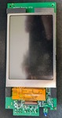

# Hearth and Home IFT-RC400 Fireplace Remote
These are my notes regarding my attempts at reverse engineering the Hearth and Home IFT-RC400 fireplace remote control.  I'm posting them on Github so they may be of use to someone with more experience.  If anyone disovers this doc and finds it useful, I'd love to hear your feedback and results.

# Hardware
The IFT-RC400 uses a 100-pin Microchip Technology PIC24FJ256DA210 at its core.  I did not investigate underneath what I assume is RF shielding on the back of the board.

## Buttons
There are two buttons accessible from the outside of the unit that can be pressed with a bent paperclip.

### Left (unmarked)
Resets the unit.

### Right ("P")
Described in the manual as "the programming hole."  Starts the "Brand/Dealer Programming Procedure" during installation.

## Switch
The switch inside the battery compartment is a child lock that enables and disables the touchscreen.

## Chip Markings
1. U2 and U11: HC374 / 16KG4 / ACG5
2. U3: 23F032B / SM / 2113V6W
3. U4: ISSI IS62WV25616EBLL-45TLI / EE1634X1 2039
4. U7: 17 TI BFM

## ICSP Header
There is a six pin header accessible inside the battery compartment, presumably for testing and programming in the field.  I was able to beep out the corresponding PIC24FJ256DA210 pins using a multimeter.

I've assigned the pin numbers starting at what I presume to be pin 1, as marked by the triangle on the case.

| ICSP header pinout  |                   |        |
| ------------------- | ----------------- | ------ |
| 2. VDD   | 4. RP6            | 6. NC  |
| 1. ?                | 3. VSS | 5. RP7 |
| △ (triangle on case)|                  |        |

### Notes on pins

1. **?:** I couldn't identify this pin's other end.  Nothing beeped out on the PIC, and the trace runs underneath the LCD screen.  I wasn't willing to remove the screen's metal backplate to follow it any further.  A replacement remote is $329!
2. **VDD**
3. **VSS**
4. **RP6/ICSPCLK/PGEC:** PIC24FJ256DA210 pin 26
5. **RP7/ICSPDAT/PGED:** PIC24FJ256DA210 pin 27
6. **NC:** Unless the board has more than the visible top and bottom layers, this pin goes nowhere.

# Attempted firmware dump
I attempted to read the PIC's memory using a PICkit 3 and MPLAB X IDE v6.20.  Unfortunately, I only received FF's and 00's in response.

I did make one useful discovery while looking at the configuration bits menu: JTAG is (theoretically) accessible.  There are no test points or unpopulated headers on the board, which means soldering directly to the PIC.  I don't have the equipment or skill to solder anything that small, so that's where my investigation ended.

# Photos
## Front

## Rear

## Chips

# Other
* FCC ID: ULE2326-110
* IC ID: 6732A-2326110
* RF frequency range: 912.4-918 MHz
* Part number: 2326-110

# Links
* [PIC Microcontroller firmware dumping guide](https://www.rapid7.com/blog/post/2019/04/30/extracting-firmware-from-microcontrollers-onboard-flash-memory-part-3-microchip-pic-microcontrollers/)
* [Installation manual](https://downloads.hearthnhome.com/installManuals/Addendums/2326_982_IFT-RC400IFT-ACM_Install_Manual.pdf)
* [FCC filing](https://fccid.io/ULE2326-110)
